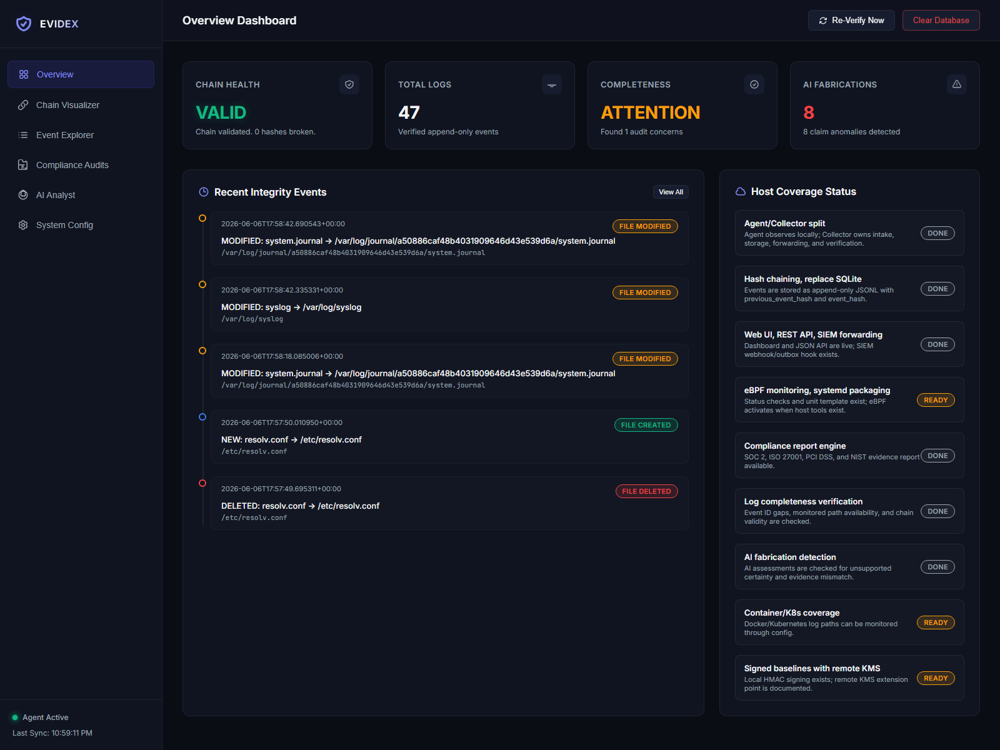
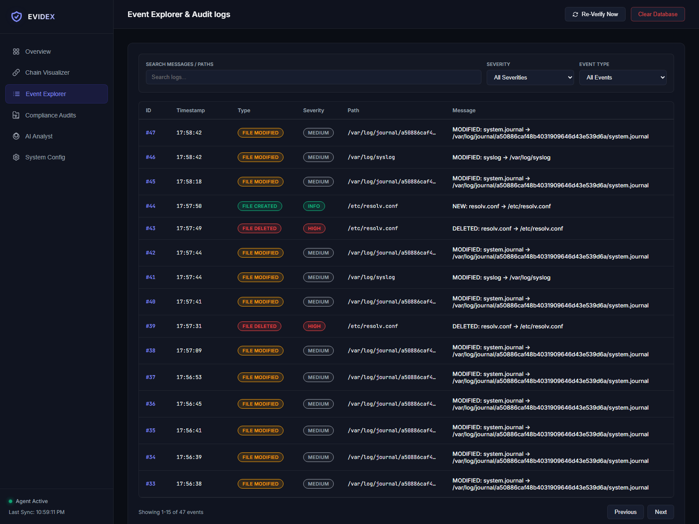
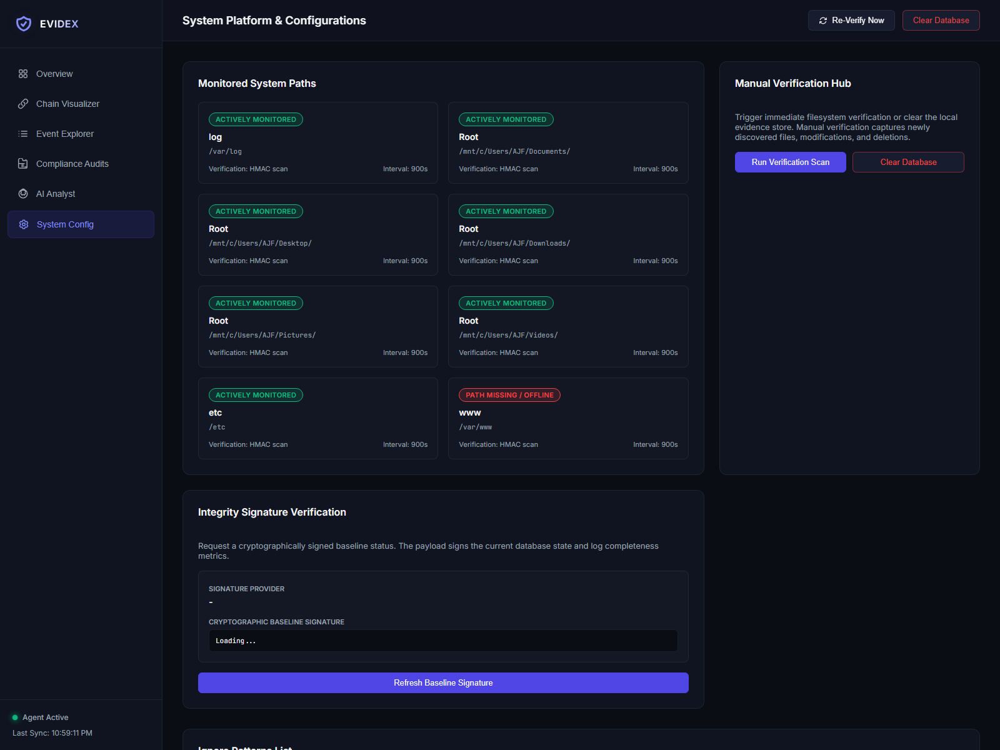
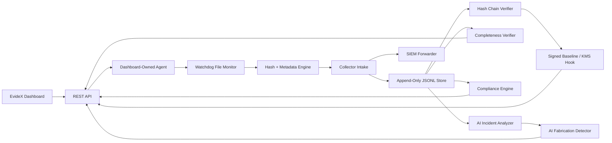
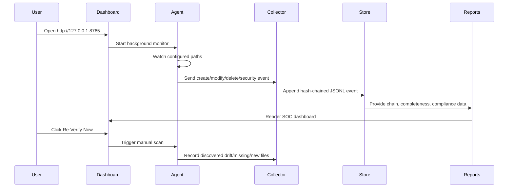

# EvideX

EvideX is a tamper-evident security evidence platform for log integrity
monitoring, incident triage, completeness verification, compliance evidence, and
SOC-style operational review.

The project is built around a simple rule:

> AI can help explain suspicious activity, but hashes, metadata, completeness
> checks, and the append-only evidence chain remain the source of truth.

EvideX is designed as a strong production-style MVP for security operations,
digital forensics, compliance demonstrations, and portfolio/capstone evaluation.

## Dashboard Preview

### SOC Overview



### Event Explorer



### Verification And Configuration



## Core Capabilities

- Agent/collector split for cleaner security architecture
- Real-time file monitoring through `watchdog`
- Manual filesystem verification from the dashboard
- WSL-to-Windows profile path mapping for Desktop, Documents, Downloads, Pictures, and Videos
- Auto-creation of missing monitored directories when possible
- SHA-256 file hashing and metadata tracking
- Append-only JSONL event store
- Per-event hash chaining using `previous_event_hash` and `event_hash`
- Baseline verification for file creation, modification, deletion, and missing files
- Security log analysis for authentication failures and sudo activity
- Dashboard-owned background agent, so users do not need a second terminal for collection
- REST API for events, health, compliance, completeness, fabrication checks, and signatures
- Compliance report engine for SOC 2, ISO 27001, PCI DSS, and NIST-style evidence
- Log completeness verification
- AI incident analysis with OpenAI/OpenRouter-compatible configuration
- AI fabrication and unsupported-claim detection
- SIEM forwarding hooks through webhook or local outbox
- Signed baseline support through local HMAC with remote KMS extension point
- Production-readiness status for systemd, eBPF, Docker, and Kubernetes paths

## Architecture



## Data Flow



## Project Structure

```text
evidex/
  agent.py              Dashboard-owned local agent wrapper
  ai.py                 Optional AI incident analysis
  api.py                REST API and SOC web dashboard
  cli.py                Command-line interface
  collector.py          Event intake, forwarding, and verification layer
  completeness.py       Event gap, path, and chain completeness checks
  compliance.py         Compliance evidence report engine
  config.py             Config defaults, .env loading, WSL path mapping
  database.py           Append-only hash-chained evidence store
  fabrication.py        AI unsupported-claim and hallucination checks
  logging_setup.py      Runtime logging
  monitor.py            Watchdog monitor and hash verification engine
  platform.py           eBPF, systemd, Docker, Kubernetes readiness
  reports.py            JSON and CSV export helpers
  security.py           Authentication and sudo log analyzers
  signing.py            Local HMAC and remote KMS signing hook
  version.py            Package version
docs/
  assets/               Dashboard screenshots for README
config.json             Runtime configuration
.env.example            Environment template
.gitignore              Ignore rules for secrets, venvs, logs, and caches
pyproject.toml          Python package metadata
README.md               Project documentation
```

## Requirements

- Python 3.10+
- Linux or WSL2 recommended
- `watchdog` Python package
- Root privileges recommended for `/var/log`, `/etc`, Docker, and Kubernetes paths
- Optional: OpenAI or OpenRouter-compatible API key for AI incident analysis
- Optional: `bpftool` or `bpftrace` for future eBPF integrations

## Clone The Repository

```bash
git clone <your-repository-url> evidex
cd evidex
```

## Install

```bash
python3 -m venv .venv
source .venv/bin/activate
pip install --upgrade pip
pip install -e .
```

Confirm the CLI is available:

```bash
evidex --help
```

## Environment Setup

Create a local `.env` file:

```bash
cp .env.example .env
```

For OpenAI:

```env
OPENAI_API_KEY=replace-with-your-api-key
OPENAI_BASE_URL=https://api.openai.com/v1
```

For OpenRouter-compatible keys:

```env
OPENAI_API_KEY=replace-with-your-openrouter-key
OPENAI_BASE_URL=https://openrouter.ai/api/v1
```

Do not commit `.env`. It is intentionally ignored by `.gitignore`.

## Configuration

EvideX uses `config.json`.

Important sections:

```json
{
  "app": {
    "name": "EvideX",
    "log_dir": "~/.local/state/evidex",
    "db_path": "~/.local/state/evidex/store"
  },
  "dashboard": {
    "host": "127.0.0.1",
    "port": 8765,
    "auto_open": false
  },
  "paths": [
    {"path": "/var/log", "recursive": true, "label": "System Logs", "enabled": true},
    {"path": "~/Desktop", "recursive": true, "label": "Desktop", "enabled": true}
  ],
  "ai": {
    "enabled": true,
    "provider": "openrouter",
    "model": "openai/gpt-4o-mini"
  }
}
```

When running inside WSL, EvideX maps user folders such as `~/Desktop` and
`~/Documents` to the Windows host profile, for example:

```text
/mnt/c/Users/AJF/Desktop
/mnt/c/Users/AJF/Documents
```

This lets the dashboard detect files created from the Windows desktop.

## Run The Complete Project

Start the dashboard:

```bash
source .venv/bin/activate
evidex --config config.json dashboard
```

Open:

```text
http://127.0.0.1:8765
```

The dashboard automatically starts the background monitoring agent. You do not
need to run a second command for basic collection.

For headless monitoring only:

```bash
evidex --config config.json run
```

## Dashboard Workflow

1. Open the dashboard.
2. Confirm the sidebar shows `Agent Active`.
3. Create, modify, or delete a file in a monitored path.
4. Click `Re-Verify Now` to trigger an immediate manual scan.
5. Review events in `Event Explorer`.
6. Review chain validity in `Chain Visualizer`.
7. Review compliance evidence in `Compliance Audits`.
8. Use `Clear Database` only when you intentionally want to reset local evidence.

## CLI Commands

```bash
evidex --config config.json dashboard
evidex --config config.json run
evidex --config config.json report
evidex --config config.json verify
evidex --config config.json compliance
evidex --config config.json fabrication
```

Command purpose:

| Command | Purpose |
| --- | --- |
| `dashboard` | Start REST API, web UI, and dashboard-owned agent |
| `run` | Run the monitoring agent in headless mode |
| `report` | Print event and AI assessment counts |
| `verify` | Verify append-only event hash chain |
| `compliance` | Print compliance evidence JSON |
| `fabrication` | Print AI unsupported-claim findings |

## REST API

| Endpoint | Method | Description |
| --- | --- | --- |
| `/api/health` | `GET` | Dashboard, agent, chain, and platform status |
| `/api/events` | `GET` | Recent append-only event records |
| `/api/ai` | `GET` | AI incident assessments |
| `/api/compliance` | `GET` | Compliance evidence report |
| `/api/completeness` | `GET` | Completeness and path coverage status |
| `/api/fabrication` | `GET` | AI hallucination/unsupported-claim audit |
| `/api/platform` | `GET` | eBPF, systemd, SIEM, K8s, signing readiness |
| `/api/phases` | `GET` | Product phase implementation status |
| `/api/baseline-signature` | `GET` | Signed baseline payload |
| `/api/verify-files` | `GET/POST` | Trigger immediate filesystem verification |
| `/api/reset` | `GET/POST` | Clear local events, AI records, baselines, offsets, and manifest |

Example:

```bash
curl http://127.0.0.1:8765/api/health | python3 -m json.tool
curl -X POST http://127.0.0.1:8765/api/verify-files
```

## Evidence Store

EvideX does not use SQLite. It stores local evidence in an append-only directory:

```text
~/.local/state/evidex/store/
  events.jsonl
  ai_analysis.jsonl
  baselines.json
  log_offsets.json
  manifest.json
```

Each event includes:

- `id`
- `timestamp`
- `event_type`
- `file_path`
- `message`
- `severity`
- `metadata`
- `previous_event_hash`
- `event_hash`

This creates a tamper-evident chain. If an event is removed or edited, `evidex
verify` reports a chain failure.

## Compliance Mapping

EvideX currently maps evidence to:

- SOC 2 CC7.2
- ISO 27001 A.8.15
- PCI DSS 10.3 / 10.5
- NIST 800-53 AU-9 / SI-7

The compliance report is evidence-oriented, not a formal certification.

## AI Analysis

AI analysis is optional. EvideX still performs deterministic local risk scoring
when AI is disabled.

Remote AI can help classify suspicious sequences, but it must not be treated as
proof of integrity. EvideX audits AI findings through the fabrication detector,
which flags unsupported certainty language and evidence mismatches.

## GitHub Upload Checklist

Before uploading:

- Keep `.env` untracked.
- Keep `.venv/` untracked.
- Keep generated `__pycache__/` and `*.egg-info/` untracked.
- Upload `README.md`, `pyproject.toml`, `config.json`, `.env.example`, `.gitignore`, `evidex/`, and `docs/assets/`.
- Decide whether old deleted files from the previous project should remain deleted.

## Current Production Readiness

EvideX is a strong production-style MVP. It is suitable for GitHub, demos,
portfolio review, and security product evaluation.

Remaining work before true enterprise production:

- Dashboard authentication and role-based access control
- HTTPS/TLS termination
- Formal test suite and CI pipeline
- Real remote KMS provider integration
- Native eBPF collector implementation
- Docker image and systemd deployment files
- Retention policy for local event store
- Multi-agent remote collector protocol
- SIEM integration test with a real destination

## Security Notes

- Run with least privilege where possible.
- Use root only when monitoring privileged paths.
- Do not expose the dashboard publicly without authentication and HTTPS.
- Treat `.env` as secret material.
- Rotate API keys if they are ever committed or shared.

## License

Add your preferred license before publishing the repository.
